# fyp_healthcare_app

A mobile healthcare app that pair with wearable sleep tracker and visualize bio readings to the user.

- - - -
Splash Screen:

- - - -
Onboarding Screen:

    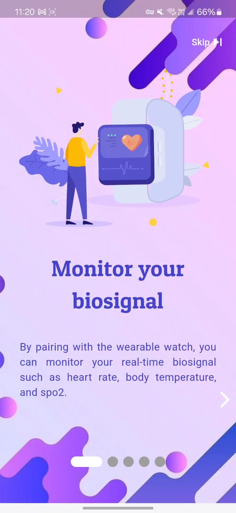
    
    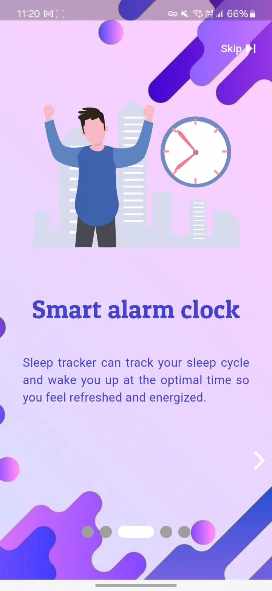
    
    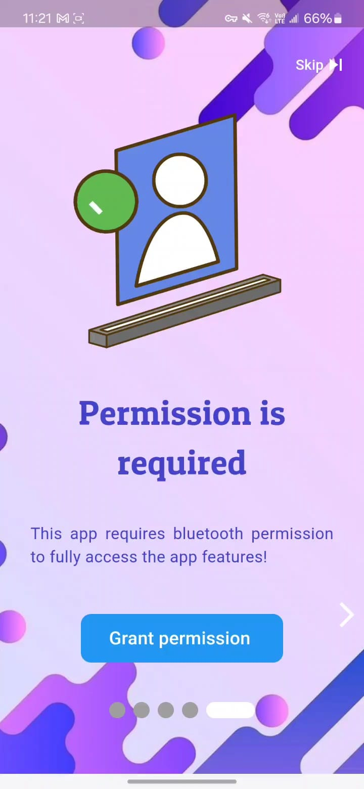

- - - -
Wearable device pairing:

    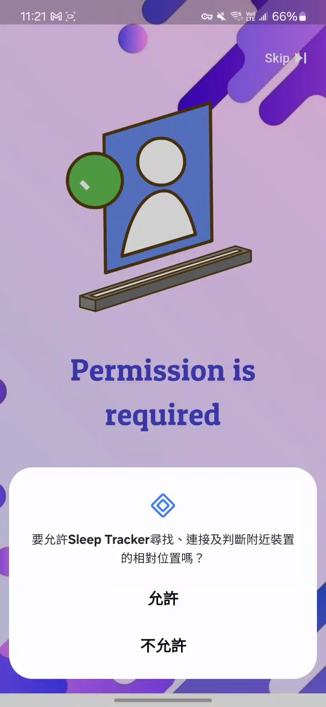
    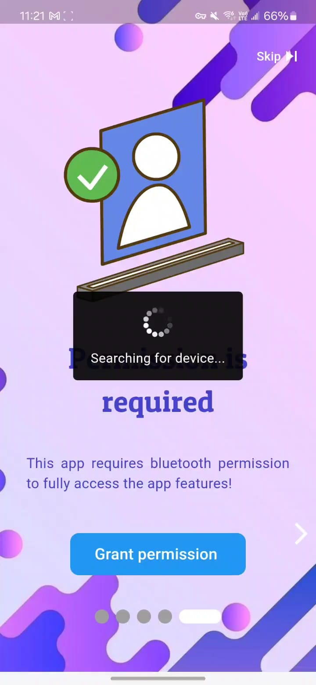
    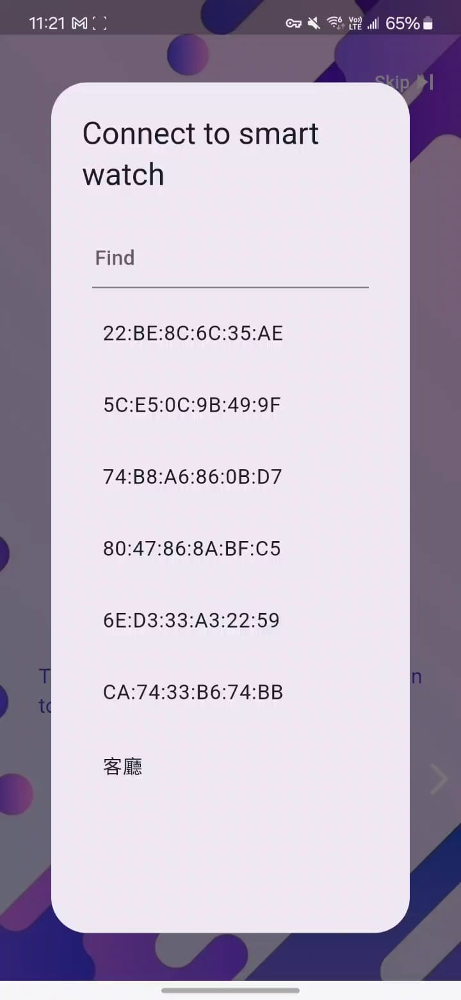

- - - -
Main function:

    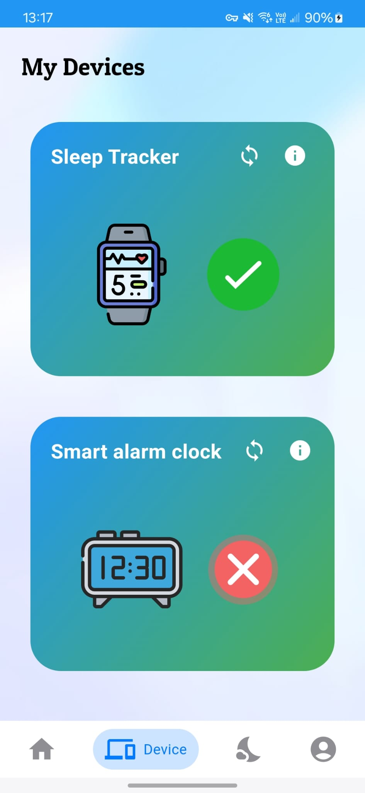
    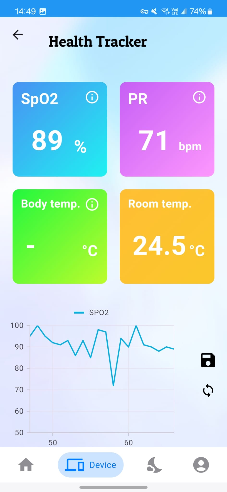
    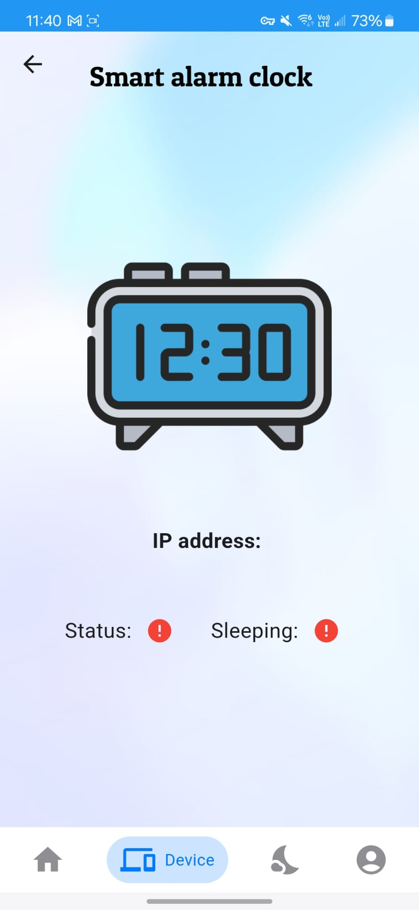
    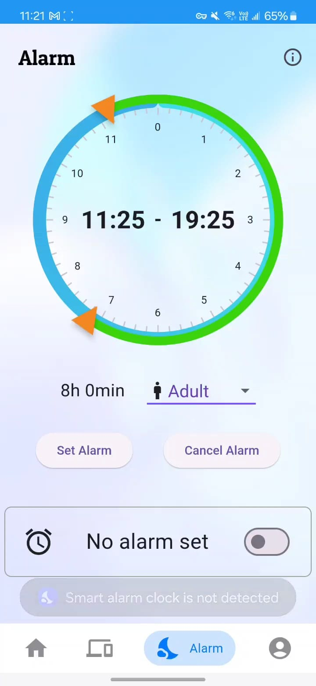

- - - -
Profile and data export/import:

    
    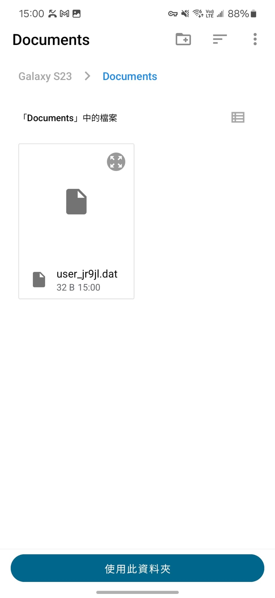

